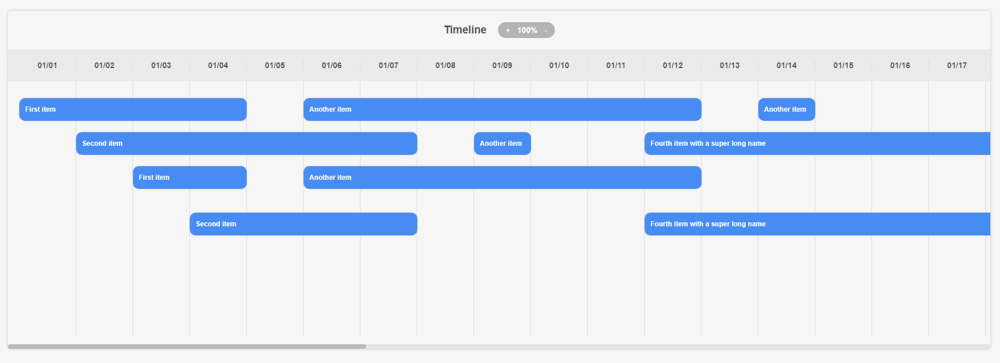

# Horizontal Timeline Implementation

## Time Spent on Assignment

The development of the horizontal timeline was completed in a focused coding session lasting two hours.

## Implementation Details

The implementation of the horizontal timeline was structured to prioritize efficiency due to the tight deadline. The timeline data is organized into sections based on start and end dates, rendered on a board that respects the spacing of events through fixed-size empty content divs, as visualized in the attached screenshots.

## Positive Aspects of the Implementation

What I appreciate most about the implementation is the algorithm used to organize the timeline items into lanes to prevent overlapping. This approach ensures that each event is placed in a dedicated horizontal space, allowing for a clear and uncluttered visual representation of concurrent events.

## Reflections for Future Implementation

Given more time, the following enhancements would be considered:

- Generation of random data for a more dynamic representation.
- Implementing resizable events to allow user interaction with the timeline.
- Adding drag-and-drop capabilities to rearrange events intuitively.
- Transitioning the data structure to a matrix format for easier rendering and manipulation of events.

## Design Decisions

The design choices were influenced by a review of existing timeline implementations. The goal was to create a clean and intuitive user interface that could be easily understood at a glance. A minimalistic approach was taken for the styling to avoid distracting from the core functionality of the timeline.

## Testing Strategy

With additional time for testing, a comprehensive strategy would include:

- Unit tests for the data organization algorithm to ensure the correctness of event placement.
- UI tests to confirm that the rendering of events matches the expected layout, especially after operations like zooming or resizing.
- Integration tests to verify that user interactions, such as clicking the zoom buttons, correctly adjust the view.
- Performance tests to assess the timeline's responsiveness with large datasets and ensure that the application scales well.

---

**Note**: The implementation reflects a snapshot of the timeline's current capabilities and is expected to evolve with further development and user feedback.
